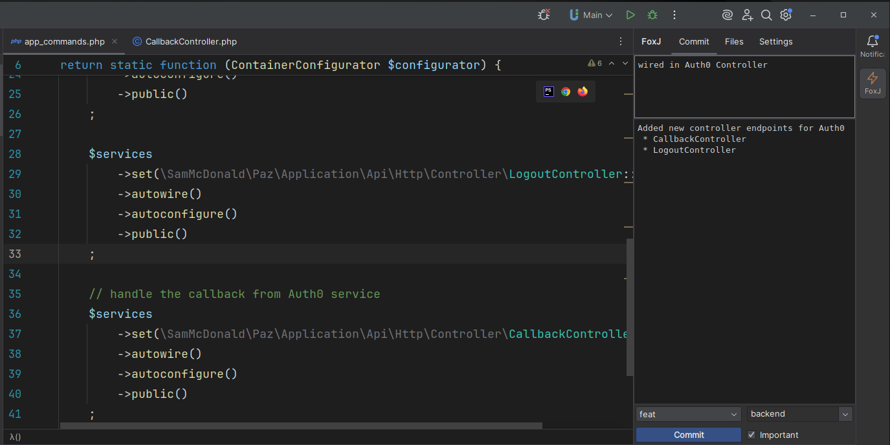
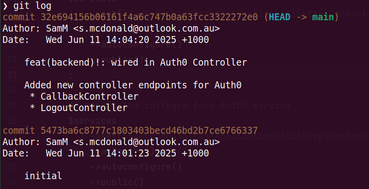
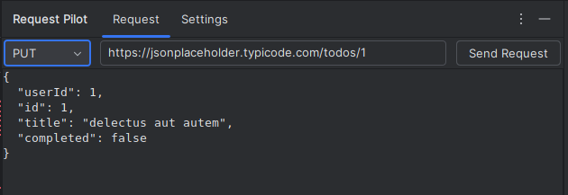

# FoxJ

**Live plugins for IntelliJ IDEA.**

## Features

| Plugin Name           | Description                                                                                           | Short Description             |
|-----------------------|-------------------------------------------------------------------------------------------------------|-------------------------------|
| **Conventional Commits** | An IntelliJ IDEA plugin that helps you create clean and consistent [Conventional Commits](https://www.conventionalcommits.org/). | Commit message formatter      |
| **HTTPilot**             | A plugin for building and testing API requests directly within IntelliJ IDEA.                      | API request tester, currently not full featured, allows for multiple types of request but only BasicAuth and BearerToken             |

## Screenshots

## Installation

1. Make sure you have the latest [LivePlugin](https://plugins.jetbrains.com/plugin/7282-liveplugin) installed in your IntelliJ IDEA-based IDE.

2. Move/Copy the files into the live plugin path.
This plugin has been tested with:

- IntelliJ IDEA Ultimate
- PhpStorm
- CLion
